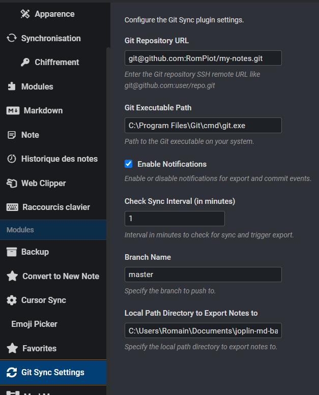

# Joplin Plugin - Sync to Git Remote

## What's it for?

This plugin allows you to synchronize all folders, notes and resources to a local folder, and synchronize it to an external repository such as Github, Gitlab, Bitbucket, etc.

## Why this plugin

I needed to make additional backups, in addition to the initial sync, in order to secure data persistence, and to be able to view my notes outside Joplin if necessary.

The source of truth remains what is on Joplin, through native synchronization, because Git merge conflicts may occur without being resolvable.
This is why, during git sync, first a Joplin sync is executed, then a forced push to the remote repository.

## Configuration

## How does the plugin work?

1. It performs a native sync to Joplin if configured (Joplin Cloud, Dropbox or OneDrive), in order to recover any changes that may have been made on other devices or by other people.
2. Create a local folder if it doesn't already exist
3. Deletes all the contents of this local folder
4. If git is not initialized in the folder
   1. If no repository is configured in the module configuration, initialize git with the configured branch
   2. If a repository is configured, git clones remote content from the configured branch
5. Export all folders, notes and resources to folder
6. Commit all
7. If remote is configured, push to remote repo on relevant branch
